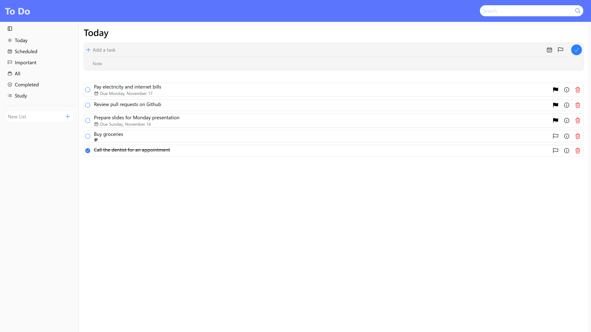
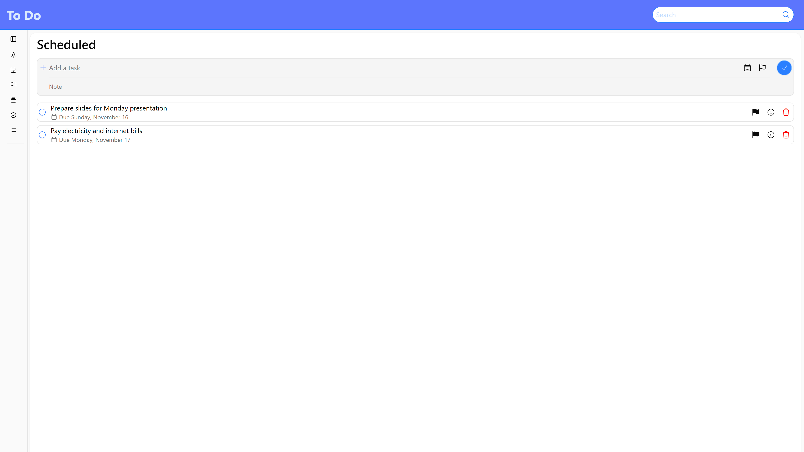
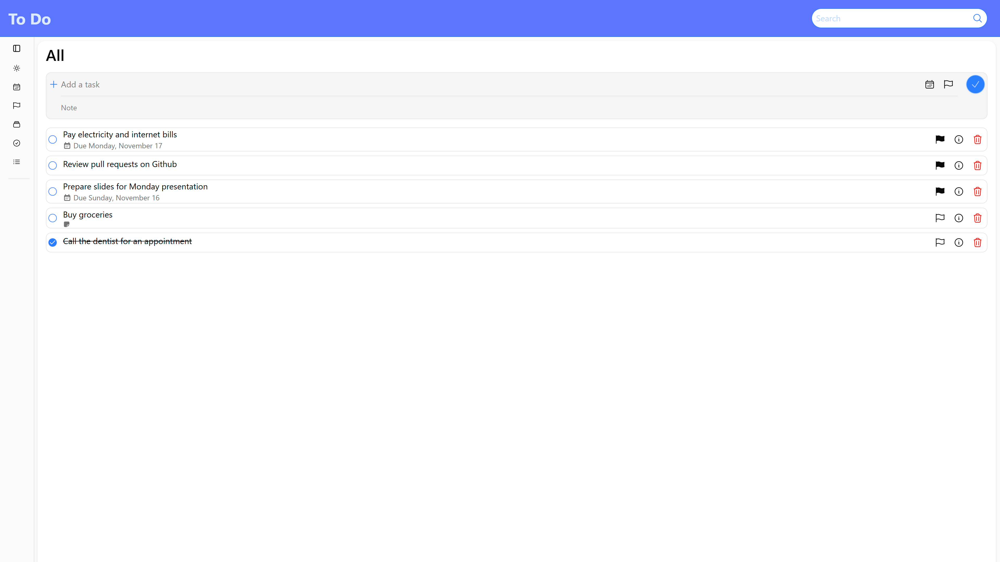
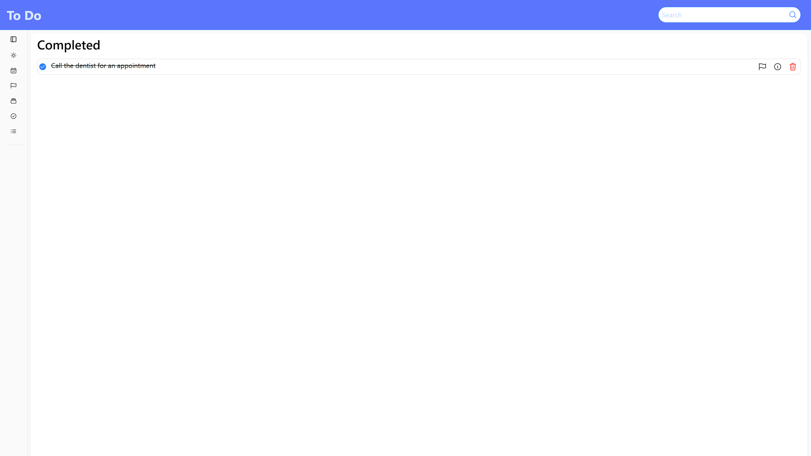
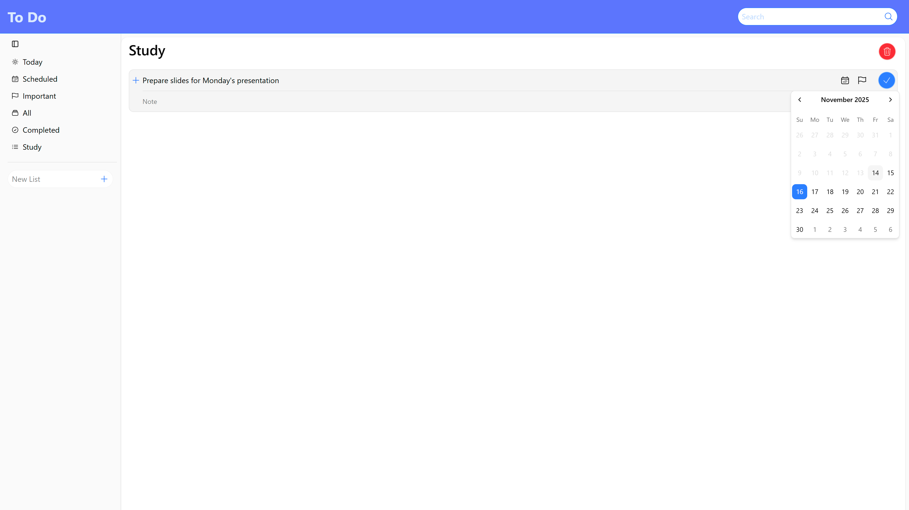

# To-Do App

> A fully featured To-Do app built with React and styled using Tailwind CSS. Allows users to manage tasks efficiently across multiple categories. Designed with a focus on usability, responsiveness and modern react best practices.

---

## 🚀 Live Demo

🔗 [View Live](https://to-do-app-flame-alpha-97.vercel.app/)

---

## ✨ Features

- Add, update and delete To-Dos.
- Can create and delete custom categories(lists).
- Filter tasks by status or type, including All, Completed, Scheduled, Important and Today.
- Each To-Do can have a note, due date, priority marking and completion status.
- Real time search to quickly find tasks across all categories.
- Context API for managing To-Dos and Lists.
- React router for navigating through different sections.

---

## 🧰 Tech Stack

- **Framework / Library:** React
- **Styling:** Tailwind CSS
- **Build Tool:** Vite

---

## 📸 Screenshots

---
